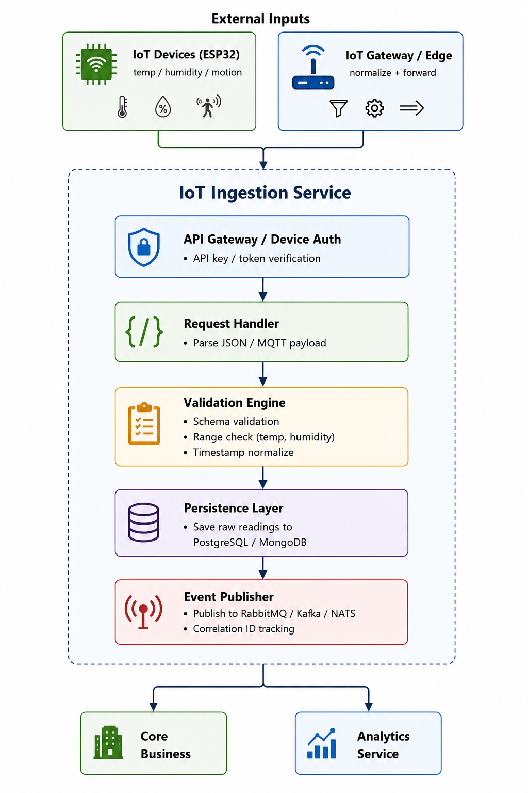

# Service Boundary — A1 IoT Ingestion Service

## 1. Thông tin nhóm

- Tên nhóm: Nhóm 6
- Lớp: CNTT17-13
- Thành viên: 
  - Nguyễn Việt Quang
  - Trần Quang Long
  - Lê Văn Hướng
  - Nguyễn Văn Huy
- Service nhóm phụ trách: **A1 IoT Ingestion Service** (dịch vụ tiếp nhận dữ liệu từ thiết bị IoT)
- Sản phẩm tổng thể của lớp: Nền tảng Smart Campus theo kiến trúc Microservices

---

## 2. Actor

Ai tương tác với hệ thống/service?

- **Thiết bị IoT** (ESP32, cảm biến nhiệt độ, độ ẩm, cảm biến chuyển động): gửi dữ liệu cảm biến định kỳ
- **IoT Gateway/Edge Device**: nhận dữ liệu từ thiết bị IoT và chuyển tiếp
- **Admin/Operator**: cấu hình thiết bị, quản lý device list, kiểm tra trạng thái
- **Service Core Business**: tiêu thụ dữ liệu để kiểm tra ngưỡng bất thường
- **Service Analytics**: lấy dữ liệu để tổng hợp thống kê, KPI
- **Hệ thống giám sát**: đẩy alert vận hành (device offline, data invalid, queue backlog)

---

## 3. System Boundary

Nhóm em xây phần nào?

**Phần nhóm kiểm soát:**

- API tiếp nhận dữ liệu cảm biến (HTTP REST hoặc MQTT)
- Xác thực thiết bị (Device ID verification, token/API key)
- Kiểm tra dữ liệu hợp lệ (validation schema, kiểm tra giá trị hợp lý)
- Chuẩn hóa dữ liệu (normalize timestamp, unit conversion)
- Lưu dữ liệu thô vào database (PostgreSQL, MongoDB)
- Phát hành event cho Core Business và Analytics qua message broker hoặc event bus
- Cung cấp endpoint health check, readiness probe

**Phần nhóm chỉ tích hợp:**

- Thiết bị IoT vật lý (ESP32, sensor hardware)
- Message Broker (RabbitMQ, Kafka, NATS) để broadcast event
- Database infrastructure (PostgreSQL, MongoDB)
- Monitoring/Logging stack (Prometheus, ELK, Jaeger)
- API Gateway hoặc Reverse Proxy (định tuyến request)

---

## 4. Service Boundary

Service của nhóm có trách nhiệm gì?

**Có:**

- Nhận request POST dữ liệu cảm biến từ IoT devices (HTTP API hoặc MQTT)
- Xác thực thiết bị (check device_id, API key hợp lệ)
- Validate dữ liệu đầu vào:
  - `device_id` không rỗng, tồn tại trong registry
  - `temperature`, `humidity` nằm trong khoảng hợp lý (e.g., -20°C ~ 60°C)
  - `motion` là boolean
  - `timestamp` hợp lệ (không quá cũ, không ở tương lai)
- Lưu dữ liệu thô vào database
- Phát hành event/message cho các service khác (Core Business, Analytics)
- Cung cấp API tra cứu lịch sử dữ liệu sensor
- Health check endpoint

**Không:**

- Không xử lý logic kiểm tra ngưỡng bất thường (để Core Business làm)
- Không gửi alert trực tiếp (để Notification Service làm)
- Không lưu trữ dữ liệu lâu dài hay archive (tùy chọn, có thể delegate cho Analytics)
- Không quản lý người dùng cuối hoặc authentication phức tạp

---

## 5. Input / Output

### Input

**HTTP POST Request:**
```json
{
  "device_id": "esp32-a101",
  "temperature": 31.5,
  "humidity": 72,
  "motion": true,
  "timestamp": "2026-05-15T10:30:00Z"
}
```

**Hoặc MQTT Topic:**
```
iot/sensors/esp32-a101
```

**Header:**
- `Authorization: Bearer <api-key>` (hoặc Device-Token)
- `Content-Type: application/json`

### Output

**HTTP Response (Success 201/200):**
```json
{
  "success": true,
  "message": "Sensor data received and queued for processing",
  "data": {
    "record_id": "rec-20260515-001",
    "device_id": "esp32-a101",
    "received_at": "2026-05-15T10:30:05Z",
    "status": "queued"
  }
}
```

**HTTP Response (Error 4xx/5xx):**
```json
{
  "type": "https://api.smartcampus.local/problems/invalid-sensor-data",
  "title": "Invalid Sensor Data",
  "status": 400,
  "detail": "Temperature value -50 is out of acceptable range [-20, 60]",
  "instance": "/api/v1/sensors/esp32-a101",
  "timestamp": "2026-05-15T10:30:05Z"
}
```

**Event/Message phát hành (qua broker):**
```json
{
  "event_id": "evt-20260515-001",
  "event_type": "iot.sensor.data.received",
  "device_id": "esp32-a101",
  "temperature": 31.5,
  "humidity": 72,
  "motion": true,
  "timestamp": "2026-05-15T10:30:00Z",
  "received_at": "2026-05-15T10:30:05Z",
  "correlation_id": "corr-xyz-123"
}
```

---

## 6. API dự kiến

| Method | Endpoint | Mục đích | Auth |
|---|---|---|---|
| POST | `/api/v1/sensors/data` | Gửi dữ liệu cảm biến | API Key |
| GET | `/api/v1/sensors/{device_id}/readings` | Tra cứu lịch sử dữ liệu thiết bị | API Key |
| GET | `/api/v1/sensors` | Liệt kê danh sách thiết bị | API Key |
| POST | `/api/v1/sensors/{device_id}/register` | Đăng ký thiết bị mới | Admin/Secret |
| PATCH | `/api/v1/sensors/{device_id}` | Cập nhật cấu hình thiết bị | Admin |
| GET | `/health` | Health check | None |
| GET | `/readiness` | Readiness probe | None |

---

## 7. Phụ thuộc service khác

**Service này gọi đến service nào?**

- **Message Broker (RabbitMQ/Kafka/NATS)**: publish event khi nhận dữ liệu
- **Database (PostgreSQL/MongoDB)**: lưu trữ dữ liệu sensor
- **Optional - Monitoring**: push metrics tới Prometheus

**Service nào gọi đến service này?**

- **Core Business Service**: gọi API để lấy dữ liệu sensor hoặc subscribe event
- **Analytics Service**: subscribe event hoặc gọi API tra cứu lịch sử
- **Admin Portal/Dashboard**: gọi API để xem/quản lý thiết bị

---

## 8. Sơ đồ kiến trúc

```
         External Inputs
┌───────────────────────┐      ┌───────────────────────┐
│ IoT Devices (ESP32)   │      │ IoT Gateway / Edge    │
│ temp/humidity/motion  │      │ normalize + forward   │
└───────────┬───────────┘      └───────────┬───────────┘
      │                              │
      └──────────────┬───────────────┘
               ▼
┌──────────────────────────────────────────────────────────┐
│                     IoT Ingestion Service                │
├──────────────────────────────────────────────────────────┤
│  ┌────────────────────────────────────────────────────┐  │
│  │ API Gateway / Device Auth                           │  │
│  │ - API key / token verification                      │  │
│  └──────────────────────────────┬─────────────────────┘  │
│                                 ▼                        │
│  ┌────────────────────────────────────────────────────┐  │
│  │ Request Handler                                    │  │
│  │ - Parse JSON / MQTT payload                         │  │
│  └──────────────────────────────┬─────────────────────┘  │
│                                 ▼                        │
│  ┌────────────────────────────────────────────────────┐  │
│  │ Validation Engine                                  │  │
│  │ - Schema validation                                 │  │
│  │ - Range check (temp, humidity)                      │  │
│  │ - Timestamp normalize                                │  │
│  └──────────────────────────────┬─────────────────────┘  │
│                                 ▼                        │
│  ┌────────────────────────────────────────────────────┐  │
│  │ Persistence Layer                                  │  │
│  │ - Save raw readings to PostgreSQL/MongoDB           │  │
│  └──────────────────────────────┬─────────────────────┘  │
│                                 ▼                        │
│  ┌────────────────────────────────────────────────────┐  │
│  │ Event Publisher                                    │  │
│  │ - Publish to RabbitMQ/Kafka/NATS                   │  │
│  │ - Correlation ID tracking                          │  │
│  └──────────────────────────────┴─────────────────────┘  │
└──────────────────────────────────────────────────────────┘
       │                         │
       ▼                         ▼
  ┌────────────┐            ┌──────────────┐
  │ Core       │            │ Analytics     │
  │ Business   │            │ Service       │
  └────────────┘            └──────────────┘
```

---

## 9. Công nghệ gợi ý

- **Runtime**: Node.js (Express/Fastify) hoặc Python (FastAPI)
- **Database**: PostgreSQL (time-series) hoặc MongoDB
- **Message Broker**: RabbitMQ hoặc Kafka
- **Authentication**: JWT/API Key
- **Validation**: Joi/Yup (Node) hoặc Pydantic (Python)
- **Monitoring**: Prometheus + Grafana
- **Containerization**: Docker

---

## 10. Giả định & Ràng buộc

- Thiết bị IoT gửi dữ liệu ít nhất mỗi 5 phút, tối đa 10 phút
- Dữ liệu sensor có thể bị trễ/mất (network unreliable) → cần idempotency key
- Mỗi thiết bị phải có device_id duy nhất và API key riêng
- Timestamp từ thiết bị có thể không chính xác → service sẽ ghi nhận received_at từ server
- Volume dự kiến: ~1000 devices × 1 message/5min = ~3,300 msg/hour

