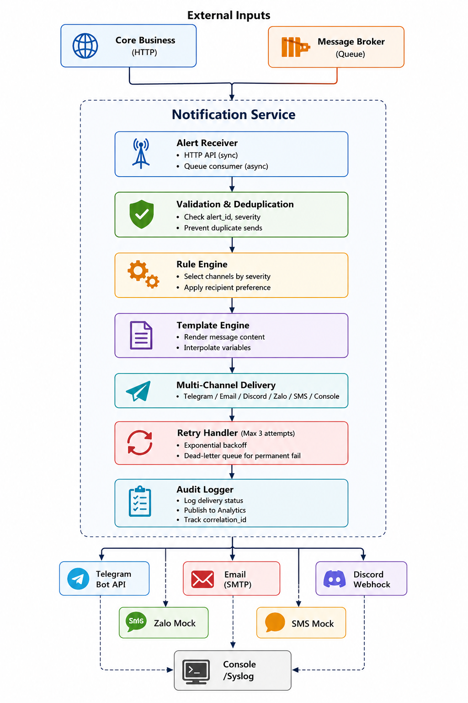

# Service Boundary — A7 Notification Service

## 1. Thông tin nhóm

- Tên nhóm: Nhóm 6
- Lớp: CNTT17-13
- Thành viên: 
  - Nguyễn Việt Quang
  - Trần Quang Long
  - Lê Văn Hướng
  - Nguyễn Văn Huy
- Service nhóm phụ trách: **A7 Notification Service** (dịch vụ gửi cảnh báo đa kênh)
- Sản phẩm tổng thể của lớp: Nền tảng Smart Campus theo kiến trúc Microservices

---

## 2. Actor

Ai tương tác với hệ thống/service?

- **Người dùng cuối (End-user)**: nhận thông báo qua Telegram, Email, SMS, Discord, etc.
- **Security Team/Operator**: nhận cảnh báo bất thường từ camera, access gate
- **Admin/Configuration Team**: cấu hình template, kênh gửi, ưu tiên
- **Service Core Business**: phát sinh alert/event yêu cầu gửi cảnh báo
- **Service Analytics**: tiêu thụ log gửi để tính KPI
- **Message Broker**: chứa queue alert chờ xử lý
- **Hệ thống giám sát**: đẩy alert về vận hành (queue backlog, delivery failed)

---

## 3. System Boundary

Nhóm em xây phần nào?

**Phần nhóm kiểm soát:**

- API tiếp nhận alert/notification request từ Core Business (sync hoặc async qua queue)
- Rule engine chọn kênh gửi phù hợp dựa trên:
  - Loại event (motion detection, unknown person, access denied)
  - Mức độ ưu tiên (low, medium, high, critical)
  - Preference của recipient
- Template engine: render nội dung thông báo
- Multi-channel delivery:
  - **Telegram Bot**: gửi message, parse reply (nếu có)
  - **Email (SMTP)**: gửi HTML/plaintext
  - **Discord Webhook**: gửi embed message
  - **Zalo Mock**: simulation (không thực sự call Zalo API)
  - **SMS Mock**: simulation (mock provider)
  - **Console/Syslog**: fallback nếu các kênh fail
- Cơ chế retry đơn giản: tối đa 3 lần, exponential backoff
- Tracking/audit: ghi log trạng thái gửi (sent, failed, retried, dead-letter)
- Health check endpoint

**Phần nhóm chỉ tích hợp:**

- API Gateway hoặc Reverse Proxy
- Identity/Auth Service (xác thực Core Business)
- Message Broker (RabbitMQ, Kafka) để nhận queue alert
- External Provider (Telegram Bot API, SMTP server, Discord, etc.)
- Analytics Service (consume log notification)
- Monitoring stack (Prometheus, ELK)

---

## 4. Service Boundary

Service của nhóm có trách nhiệm gì?

**Có:**

- Nhận request gửi cảnh báo từ Core Business (HTTP hoặc Queue message)
- Xác thực request (auth header, signature check)
- Validate dữ liệu alert:
  - `alert_id` không rỗng, duy nhất
  - `severity` trong danh sách: low, medium, high, critical
  - `message` không quá dài, không chứa ký tự đặc biệt không hợp lệ
  - `target` tồn tại trong recipient list
- Áp dụng rule: chọn kênh gửi phù hợp theo severity và recipient preference
- Render content từ template + variables
- Thực thi gửi đa kênh, retry nếu thất bại
- Ghi log/audit trạng thái gửi (sent, failed, retried, dead-letter)
- Cung cấp API tra cứu lịch sử gửi, trạng thái
- Health check endpoint

**Không:**

- Không định nghĩa logic kiểm tra bất thường (để Core Business làm)
- Không quản lý người dùng hay permission (để Identity Service làm)
- Không lưu template alert (template sẽ được config từ hệ thống hoặc hardcode)
- Không gửi SMS thực sự (mock provider để demo)
- Không phân tích pattern gửi (để Analytics làm)

---

## 5. Input / Output

### Input

**HTTP POST Request (Sync):**
```json
{
  "alert_id": "ALT-20260515-001",
  "severity": "high",
  "message": "Unknown person detected near main gate",
  "target": "security_team",
  "template_id": "tpl-intrusion-alert",
  "variables": {
    "location": "main_gate",
    "timestamp": "2026-05-15T10:30:00Z",
    "camera_id": "cam-01"
  }
}
```

**Hoặc Queue Message (Async):**
```json
{
  "event_id": "evt-20260515-001",
  "event_type": "security.intrusion.detected",
  "alert_id": "ALT-20260515-001",
  "severity": "high",
  "message": "Unknown person detected near main gate",
  "target": "security_team",
  "template_id": "tpl-intrusion-alert",
  "variables": {...},
  "correlation_id": "corr-xyz-123"
}
```

**Header:**
- `Authorization: Bearer <api-key>`
- `Content-Type: application/json`

### Output

**HTTP Response (Success 202/200):**
```json
{
  "success": true,
  "message": "Notification queued for delivery",
  "data": {
    "notification_id": "ntf-20260515-001",
    "alert_id": "ALT-20260515-001",
    "status": "queued",
    "channels": ["telegram", "email"],
    "queued_at": "2026-05-15T10:30:05Z"
  }
}
```

**HTTP Response (Error 4xx/5xx):**
```json
{
  "type": "https://api.smartcampus.local/problems/invalid-alert",
  "title": "Invalid Alert Data",
  "status": 400,
  "detail": "Field 'severity' must be one of: low, medium, high, critical",
  "instance": "/api/v1/notifications",
  "timestamp": "2026-05-15T10:30:05Z"
}
```

**Delivery Report Event (qua broker hoặc webhook):**
```json
{
  "notification_id": "ntf-20260515-001",
  "alert_id": "ALT-20260515-001",
  "event_type": "notification.delivery.status",
  "channels": [
    {
      "name": "telegram",
      "status": "sent",
      "message_id": "msg-tg-12345",
      "sent_at": "2026-05-15T10:30:06Z"
    },
    {
      "name": "email",
      "status": "sent",
      "recipient": "security@smartcampus.local",
      "sent_at": "2026-05-15T10:30:07Z"
    }
  ],
  "correlation_id": "corr-xyz-123"
}
```

---

## 6. API dự kiến

| Method | Endpoint | Mục đích | Auth |
|---|---|---|---|
| POST | `/api/v1/notifications` | Gửi cảnh báo | API Key |
| GET | `/api/v1/notifications/{id}` | Xem trạng thái cảnh báo | API Key |
| GET | `/api/v1/notifications` | Tra cứu lịch sử cảnh báo | API Key |
| POST | `/api/v1/templates` | Tạo template cảnh báo | Admin |
| PATCH | `/api/v1/templates/{id}` | Cập nhật template | Admin |
| POST | `/api/v1/channels/test` | Test kênh gửi (Telegram, Email, etc.) | Admin |
| GET | `/health` | Health check | None |
| GET | `/readiness` | Readiness probe | None |

---

## 7. Phụ thuộc service khác

**Service này gọi đến service nào?**

- **Message Broker (RabbitMQ/Kafka)**: subscribe queue alert từ Core Business
- **Telegram Bot API**: gửi message qua bot
- **SMTP Server**: gửi email
- **Discord API**: gửi webhook message
- **Analytics Service (hoặc logging)**: publish delivery log

**Service nào gọi đến service này?**

- **Core Business Service**: gửi alert khi phát hiện bất thường (motion, intrusion, access denied)
- **Admin Portal**: quản lý template, config kênh, test delivery
- **Message Broker**: consumer của alert queue

---

## 8. Sơ đồ kiến trúc

```
       External Inputs
┌───────────────────────┐      ┌────────────────────────┐
│ Core Business (HTTP)  │      │ Message Broker (Queue) │
└───────────┬───────────┘      └───────────┬────────────┘
    │                              │
    └──────────────┬───────────────┘
           ▼
┌──────────────────────────────────────────────────────────┐
│                  Notification Service                    │
├──────────────────────────────────────────────────────────┤
│  ┌────────────────────────────────────────────────────┐  │
│  │ Alert Receiver                                     │  │
│  │ - HTTP API (sync)                                  │  │
│  │ - Queue consumer (async)                           │  │
│  └──────────────────────────────┬─────────────────────┘  │
│                                 ▼                        │
│  ┌────────────────────────────────────────────────────┐  │
│  │ Validation & Deduplication                         │  │
│  │ - Check alert_id, severity                          │  │
│  │ - Prevent duplicate sends                           │  │
│  └──────────────────────────────┬─────────────────────┘  │
│                                 ▼                        │
│  ┌────────────────────────────────────────────────────┐  │
│  │ Rule Engine                                        │  │
│  │ - Select channels by severity                       │  │
│  │ - Apply recipient preference                        │  │
│  └──────────────────────────────┬─────────────────────┘  │
│                                 ▼                        │
│  ┌────────────────────────────────────────────────────┐  │
│  │ Template Engine                                    │  │
│  │ - Render message content                            │  │
│  │ - Interpolate variables                             │  │
│  └──────────────────────────────┬─────────────────────┘  │
│                                 ▼                        │
│  ┌────────────────────────────────────────────────────┐  │
│  │ Multi-Channel Delivery                             │  │
│  │ - Telegram / Email / Discord / Zalo / SMS / Console │  │
│  └──────────────────────────────┬─────────────────────┘  │
│                                 ▼                        │
│  ┌────────────────────────────────────────────────────┐  │
│  │ Retry Handler (Max 3 attempts)                      │  │
│  │ - Exponential backoff                               │  │
│  │ - Dead-letter queue for permanent fail              │  │
│  └──────────────────────────────┬─────────────────────┘  │
│                                 ▼                        │
│  ┌────────────────────────────────────────────────────┐  │
│  │ Audit Logger                                       │  │
│  │ - Log delivery status                               │  │
│  │ - Publish to Analytics                              │  │
│  │ - Track correlation_id                              │  │
│  └──────────────────────────────┴─────────────────────┘  │
└──────────────────────────────────────────────────────────┘
       │              │                 │
       ▼              ▼                 ▼
    ┌────────────┐  ┌────────────┐   ┌──────────────┐
    │ Telegram   │  │   Email    │   │   Discord    │
    │ Bot API    │  │  (SMTP)    │   │   Webhook    │
    └────────────┘  └────────────┘   └──────────────┘
         │                   │
         ▼                   ▼
       ┌────────────┐     ┌──────────────┐
       │ Zalo Mock  │     │   SMS Mock   │
       └────────────┘     └──────────────┘
          │
          ▼
        ┌────────────┐
        │  Console   │
        │  /Syslog   │
        └────────────┘
```

---


## 9. Kênh gửi chi tiết

### 9.1 Telegram Bot

- **Cấu hình**: Telegram Bot Token
- **Đầu vào**: User ID/Chat ID
- **Đầu ra**: Message ID, timestamp
- **Lỗi xử lý**: Retry, fallback to email
- **Mock mode**: In log thay vì call thực

### 9.2 Email (SMTP)

- **Cấu hình**: SMTP server, port, auth
- **Đầu vào**: Email recipient, subject, HTML body
- **Đầu ra**: Message ID
- **Lỗi xử lý**: Retry với backoff
- **Template**: HTML template per alert type

### 9.3 Discord Webhook

- **Cấu hình**: Webhook URL per channel
- **Đầu vào**: Embed message (title, description, color)
- **Đầu ra**: Message ID
- **Lỗi xử lý**: Retry
- **Format**: Rich embed với color by severity

### 9.4 Zalo Mock

- **Cấu hình**: Hardcode
- **Đầu vào**: User ID, message
- **Đầu ra**: Simulated message ID
- **Behavior**: In log, simulate delay (100-500ms)

### 9.5 SMS Mock

- **Cấu hình**: Hardcode
- **Đầu vào**: Phone number, message (max 160 chars)
- **Đầu ra**: Simulated SMS ID
- **Behavior**: In log, simulate failure rate 5%

---

## 10. Công nghệ gợi ý

- **Runtime**: Node.js (Express/Fastify) hoặc Python (FastAPI)
- **Message Queue**: RabbitMQ hoặc Kafka
- **Email**: Nodemailer (Node) hoặc smtplib (Python)
- **Telegram**: telegram-bot-sdk
- **Discord**: discord.js hoặc webhook library
- **Database**: PostgreSQL (audit log)
- **Caching**: Redis (rate limiting, dedup cache)
- **Monitoring**: Prometheus + Grafana
- **Containerization**: Docker

---

## 11. Giả định & Ràng buộc

- Alert severity được phân loại: `low` → Email/Discord, `medium` → Telegram + Email, `high/critical` → tất cả kênh
- Mỗi recipient có preference (đặt channel ưu tiên)
- Đảm bảo idempotency bằng `alert_id` → không gửi duplicate
- Timeout gửi mỗi kênh: 5-10 giây
- Retry tối đa 3 lần, backoff: 1s, 2s, 4s
- Message có correlation_id để trace end-to-end
- Volume dự kiến: ~100-500 alert/hour tùy mùa/giờ cao điểm

