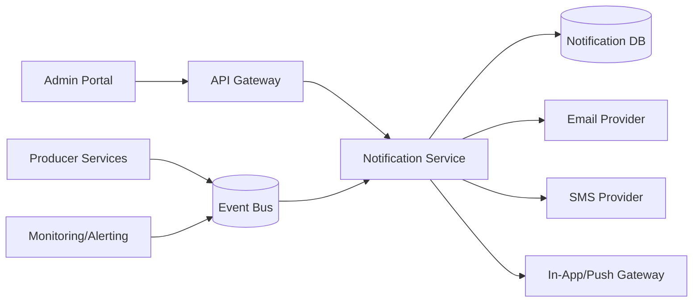

# Service Boundary của nhóm

## 1. Thông tin nhóm

- Tên nhóm: Nhóm 
- Lớp: CNTT17-13
- Thành viên: 
        Nguyễn Việt Quang
        Trần Quang Long
        Lê Văn Hướng
        Nguyễn Văn Huy
- Service nhóm phụ trách: A7 Product A Notification (dịch vụ gửi cảnh báo đa kênh)
- Sản phẩm tổng thể của lớp: Nền tảng Product A theo kiến trúc Microservices

## 2. Actor

Ai tương tác với hệ thống/service?

- Người dùng cuối (end-user): nhận thông báo qua app/email/SMS.
- Admin/Operator: cấu hình kênh gửi, template và mức ưu tiên cảnh báo.
- Service nghiệp vụ khác: phát sinh sự kiện để yêu cầu Notification Service gửi cảnh báo.
- Hệ thống giám sát: đẩy alert vận hành (error, timeout, queue backlog).

## 3. System Boundary

Nhóm em xây phần nào?

Phần nhóm kiểm soát:

- API tiếp nhận yêu cầu gửi cảnh báo (sync + async).
- Rule engine chọn kênh gửi (in-app, email, SMS) theo loại sự kiện và mức độ ưu tiên.
- Quản lý template thông báo theo từng kênh.
- Hàng đợi và cơ chế retry/dead-letter cho thông báo gửi lỗi.
- CSDL Notification (lưu lịch sử gửi, trạng thái, metadata).

Phần nhóm chỉ tích hợp:

- API Gateway hoặc Reverse Proxy (định tuyến request).
- Identity/Auth Service (xác thực và phân quyền caller).
- Email/SMS Provider bên thứ ba (SMTP, Twilio, v.v.).
- Event Bus/Message Broker (RabbitMQ/Kafka/NATS) để nhận event.

## 4. Service Boundary

Service của nhóm có trách nhiệm gì?

- Nhận yêu cầu gửi cảnh báo từ API hoặc event bus.
- Chuẩn hóa nội dung theo template và dữ liệu đầu vào.
- Chọn kênh gửi phù hợp theo rule và preference.
- Thực thi gửi đa kênh, theo dõi trạng thái gửi, retry khi lỗi tạm thời.
- Cung cấp endpoint health/readiness và truy vấn lịch sử gửi.

Service KHÔNG làm gì?

- Không xử lý nghiệp vụ lõi của các domain khác (đơn hàng, thanh toán, học vụ...).
- Không thay thế Identity/Auth Service.
- Không đảm bảo người dùng đã đọc thông báo ngoài phạm vi tracking in-app cơ bản.
- Không lưu dữ liệu nghiệp vụ gốc của producer service.

## 5. Input / Output

### Input

- HTTP request JSON từ producer service hoặc admin portal.
- Event message từ broker (ví dụ: `order.created`, `payment.failed`, `system.alert`).
- Access token/JWT hoặc service-to-service credential.
- Payload gồm: `recipient`, `channel`, `priority`, `templateId`, `variables`.

### Output

- JSON response chuẩn gồm `success`, `message`, `data`.
- Mã trạng thái HTTP phù hợp (`200`, `201`, `202`, `400`, `401`, `403`, `404`, `429`, `500`).
- Event phản hồi trạng thái gửi (sent/failed/retried/dead-letter) cho hệ thống quan sát.
- Log/audit record để đối soát lịch sử thông báo.

## 6. API dự kiến

| Method | Endpoint | Mục đích |
|---|---|---|
| GET | /health | Kiểm tra service |
| POST | /api/v1/notifications | Gửi một thông báo tức thời |
| POST | /api/v1/notifications/bulk | Gửi thông báo hàng loạt |
| GET | /api/v1/notifications/{id} | Xem trạng thái một thông báo |
| GET | /api/v1/notifications | Tra cứu lịch sử gửi theo bộ lọc |
| POST | /api/v1/templates | Tạo template thông báo |
| PATCH | /api/v1/templates/{id} | Cập nhật template |
| POST | /api/v1/channels/test | Test cấu hình kênh gửi |

## 7. Phụ thuộc service khác

Service này gọi đến service nào?

- Email Provider/SMTP Gateway: gửi email.
- SMS Provider: gửi SMS/OTP cảnh báo khẩn.
- Push Gateway/WebSocket: gửi in-app hoặc push notification.
- Event Bus: publish trạng thái xử lý thông báo.

Service nào gọi đến service này?

- Product A API Gateway/Admin Portal.
- Order/Payment/User/Inventory Service (hoặc service nghiệp vụ tương đương) phát sinh event cần cảnh báo.
- Monitoring/Observability stack gửi alert kỹ thuật.

## 8. Sơ đồ minh họa

Có thể vẽ bằng Mermaid, draw.io, Ludichart hoặc ảnh chụp sơ đồ.

